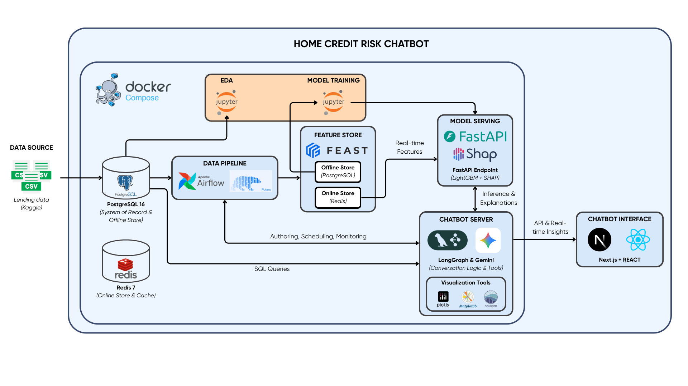
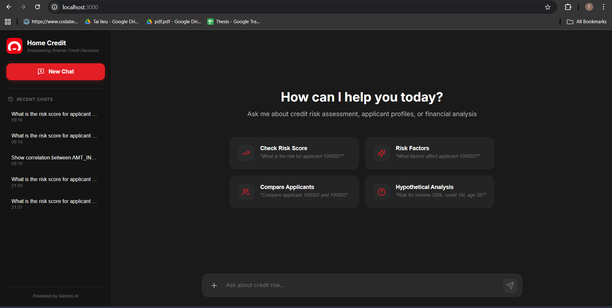

# Home Credit Risk Chatbot

An end‑to‑end credit‑risk analysis and conversational assistant platform. The system ingests lending data, engineers features, trains predictive models, serves real‑time scores, and exposes the results through a guided chatbot experience.

The high‑level architecture (see `assets/architecture.png`) is composed of:



- **Orchestration:** Docker Compose coordinates local services.
- **Exploratory analysis & training:** Jupyter notebooks for EDA and model development.
- **Data pipeline:** Apache Airflow orchestrating Polars data transforms.
- **Storage:** PostgreSQL 16 as the system of record.
- **Cache & Online Store:** Redis 7 for low-latency feature retrieval.
- **Feature store:** Feast managing offline (PostgreSQL) / online (Redis) features.
- **Model serving:** FastAPI endpoint with LightGBM model + SHAP explanations.
- **Chatbot server:** LangGraph state machine with Google Gemini, plus helper tools for queries, inference, and visualization.
- **Interface:** Next.js 14 + React + TypeScript frontend that surfaces chatbot insights to stakeholders.

## Demo




## 🛠️ Tech Stack

| Layer | Technology |
|-------|------------|
| **Frontend** | Next.js 14, React 18, TypeScript, Recharts, Lucide React |
| **Chatbot Backend** | FastAPI, LangGraph, LangChain, Google Gemini |
| **Model Serving** | FastAPI, LightGBM, SHAP, scikit-learn |
| **Feature Store** | Feast (PostgreSQL offline store, Redis online store) |
| **Data Pipeline** | Apache Airflow, Polars, PyArrow |
| **Database** | PostgreSQL 16 Alpine |
| **Cache** | Redis 7 Alpine |
| **Visualization** | Plotly, Matplotlib, Seaborn |
| **Containerization** | Docker, Docker Compose |

## Initial Setup Checklist

1. **Install prerequisites**
   - Docker Engine ≥ 24 and Docker Compose plugin.
   - Python 3.12 (for local notebooks and utilities).
   - Node.js 18+ (for frontend development).
   - `make`, `git`, and `openssl` (Airflow + Feast bootstrapping).
2. **Clone the repository**
   ```bash
   git clone <your-fork-url> hc-risk-chatbot
   cd hc-risk-chatbot
   ```
3. **Create `config/.env`** by copying the template and filling in credentials:
   ```bash
   cp config/.env.example config/.env
   ```
   Then edit it with values such as:
   ```
   POSTGRES_USER=hc_admin
   POSTGRES_PASSWORD=hc_password
   POSTGRES_DB=homecredit_db
   ```
4. **Download the dataset** from Kaggle into `data/raw/home-credit-default-risk/` using the original file names (already present in this repo for convenience).

## Docker Compose Stack

The `docker-compose.yml` includes the following services:

| Service | Description | Port |
|---------|-------------|------|
| `postgres` | PostgreSQL 16 database seeded with Home Credit datasets | 5432 |
| `redis` | Redis 7 for caching and Feast online store | 6379 |
| `airflow` | Apache Airflow for data pipeline orchestration | 8080 |
| `model_serving` | FastAPI model inference with SHAP explanations | 8001 |
| `chatbot` | LangGraph + Gemini chatbot backend | 8500 |
| `frontend` | Next.js React frontend | 3000 |

## Step-by-Step Bootstrap

### 1. Build all images

```bash
docker compose build
```

### 2. Start PostgreSQL

```bash
docker compose up -d postgres
```

Wait for the health check to pass (`docker compose ps`).

### 3. Dataset seeding

The `db/init/` scripts automatically create the `home_credit` schema and populate the following tables during the first container start:

- `application_train`
- `application_test`
- `bureau`
- `bureau_balance`
- `credit_card_balance`
- `pos_cash_balance`

To reload everything after the container already exists, run:

```bash
make reload
```

Under the hood this executes both `/docker-entrypoint-initdb.d/02_load_application.sql` and `/docker-entrypoint-initdb.d/04_load_bureau.sql`.

### 4. Inspect the data

Connect via `psql` or your preferred client:

```bash
docker compose exec postgres psql -U "${POSTGRES_USER:-hc_admin}" -d "${POSTGRES_DB:-homecredit_db}"
```

Example queries:

```sql
SELECT TARGET, COUNT(*) FROM home_credit.application_train GROUP BY TARGET ORDER BY TARGET;
SELECT COUNT(*) FROM home_credit.bureau;
SELECT COUNT(*) FROM home_credit.credit_card_balance;
```

### 5. Start all services

Once PostgreSQL is ready with data, start the entire stack:

```bash
docker compose up -d
```

### 6. Access the application

| Service | URL |
|---------|-----|
| **Frontend** | http://localhost:3000 |
| **Chatbot API** | http://localhost:8500 |
| **Model API** | http://localhost:8001 |
| **Airflow** | http://localhost:8080 |

## 📁 Project Structure

```
hc-risk-chatbot/
├── config/               # Environment configuration (.env files)
├── data/
│   └── raw/              # Raw Home Credit datasets from Kaggle
├── db/
│   └── init/             # PostgreSQL initialization scripts
├── docs/                 # Documentation
├── models/               # Trained ML models and artifacts
├── notebooks/            # Jupyter notebooks for EDA and training
├── services/
│   ├── airflow/          # Airflow DAGs and configuration
│   ├── chatbot/          # LangGraph + Gemini chatbot service
│   ├── feast/            # Feast feature store configuration
│   ├── frontend/         # Next.js React frontend
│   └── model_serving/    # FastAPI model inference service
├── docker-compose.yml    # Docker Compose orchestration
├── Makefile              # Common development commands
└── pyproject.toml        # Python project configuration
```

## 📚 Service Documentation

For detailed documentation on each service:

- **Chatbot Service:** [`services/chatbot/README.md`](services/chatbot/README.md)
- **Feast Feature Store:** [`services/feast/README.md`](services/feast/README.md)
- **Quick Start Guide:** [`QUICKSTART.md`](QUICKSTART.md)

## 🤝 Contributing

Pull requests are welcome. For major changes, please open an issue first to discuss what you would like to change.

## 📄 License

[MIT](https://choosealicense.com/licenses/mit/)
